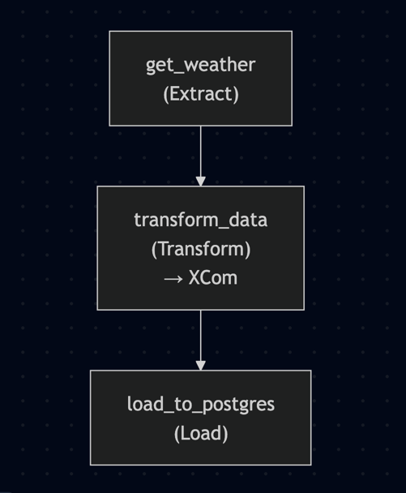

## Weather Data Pipeline

Проект реализует ETL-пайплайн на ***Apache Airflow***, который ежедневно получает json с погодными данными с
*api.openweathermap.org*, преобразует в нормализованную форму и сохраняет в таблицу PostgreSQL.

Обмен данными между задачами происходит через XCom.

### Схема DAG в Apache Airflow:

### Технологии:

- Python
- Apache Airflow
- PostgreSQL
